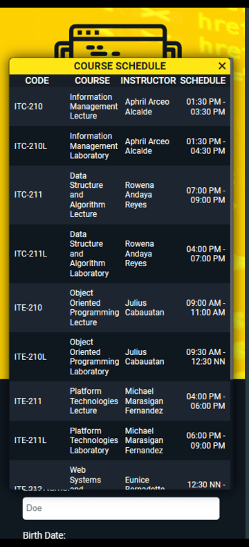

# Registration Form and Table #
## Homework no.2 in ITE-212/212L Web Systems and Technologies ##
### Secretario, Kurt O.  CEIT - 37 - 304P ###

__*Directions:*__ 
  1. Design a registration form with input fields for name, email, password, and date of birth.
  2. Create a table displaying a list of courses, including columns for course name, instructor, and schedule.
  3. Apply CSS styles to the registration form.
  4. Use different selectors (class, id, element) and properties (color, font, margin, padding).

__*Description:*__

This repository contains a sample website that demonstrates the creation of a user registration form and table using HTML5 and CSS3. The design implementation leverages modern web development practices, including responsive web design techniques, to ensure compatibility across various devices and screen sizes. Moreover, this project serves as a practical example for beginner developers, like me, seeking to understand the fundamentals of web design and front-end development using the latest web technologies.

__*Content Images:*__

  *Big screens:*
  
  

  
  
  *Small screens:*
  
    
